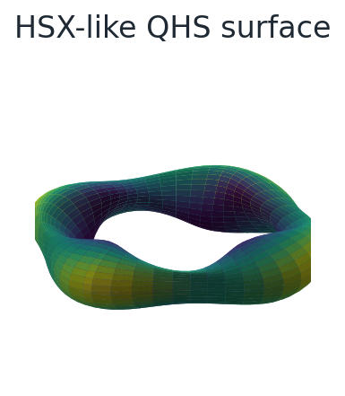
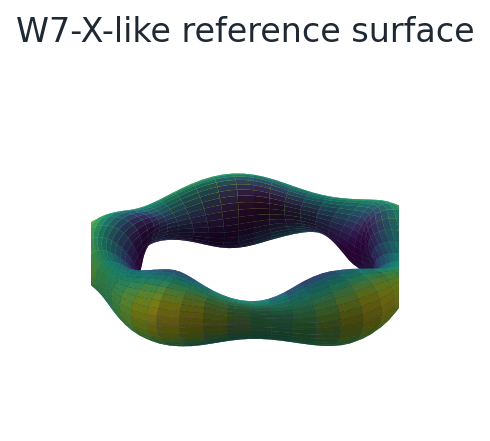
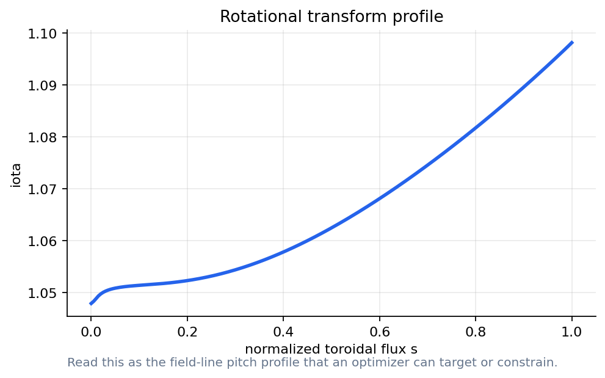
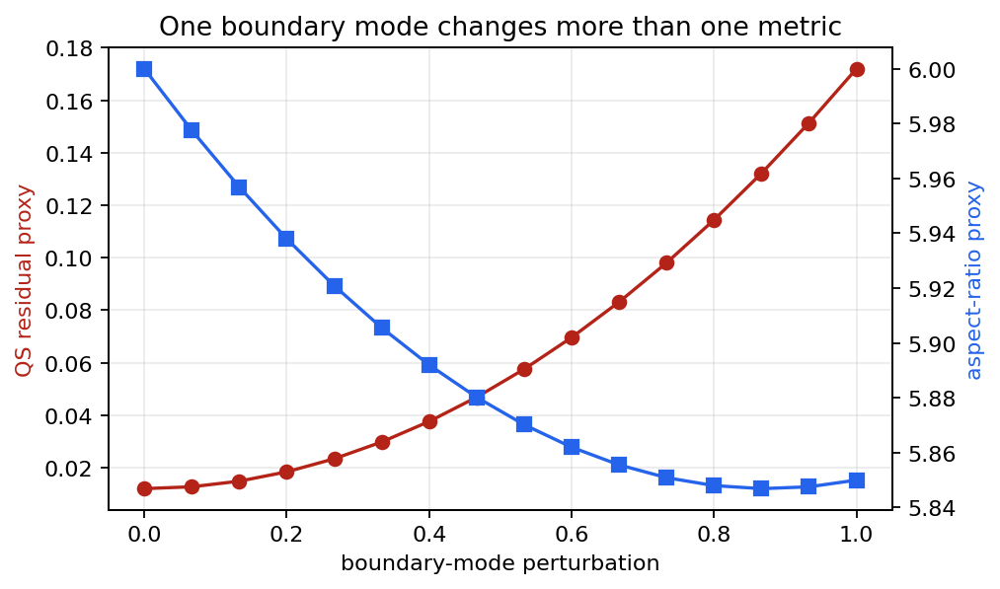
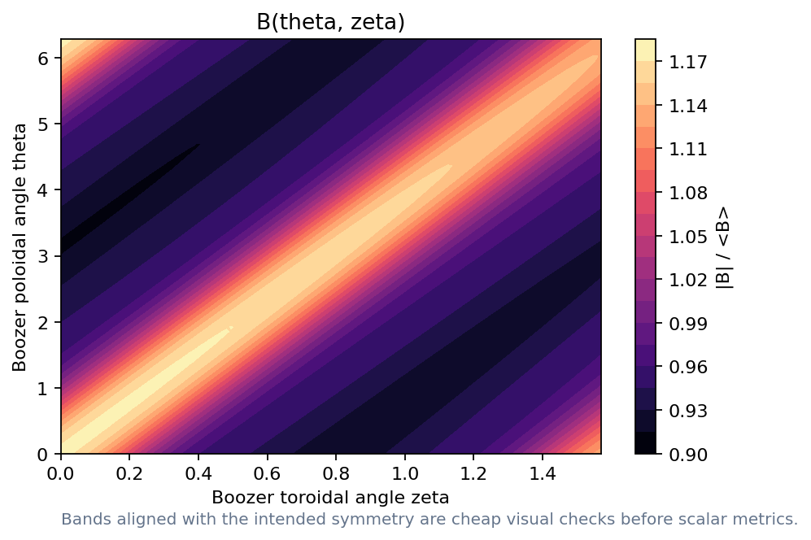
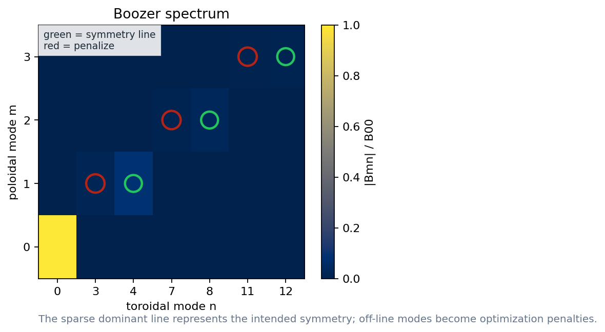
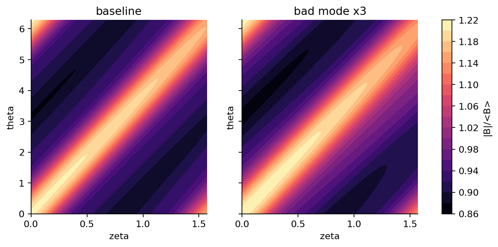
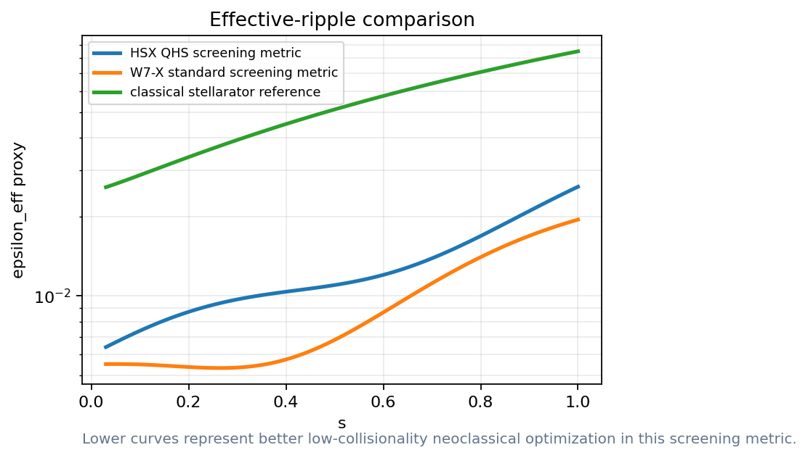
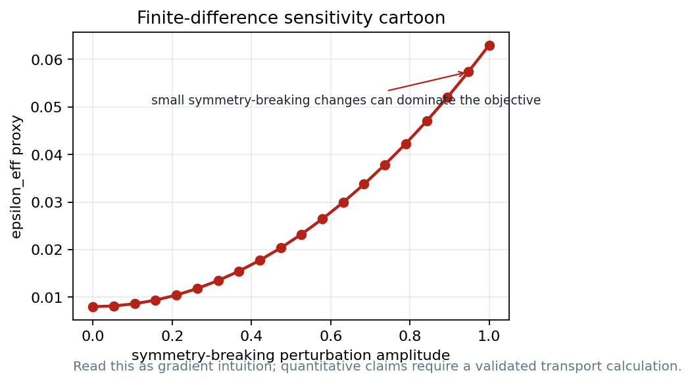

# Can we design a stellarator by following gradients?
Lecture 1: what the optimizer actually sees

- Equilibrium, Boozer spectrum, and metrics become the design language
- Docs: https://sos2026-rjorge-stellarator-optimization.readthedocs.io/

---

# PART 1. From field lines to hidden symmetry
- Goal: turn confinement physics into computable objectives
- Caveat: geometry freedom creates an inverse problem

---

# Metrics are compressed physics
- They are useful only when we know what was compressed

---

# What is rotational transform?
- **Term:** Rotational transform, iota
- **Definition:** The number of poloidal turns a magnetic field line makes per toroidal turn on a flux surface.
- **Equation:** iota = Delta theta / Delta zeta
- **Physical meaning:** Iota controls field-line pitch and where rational surfaces can appear.
- **Optimizer sees:** The optimizer can shape the radial iota profile or avoid low-order rationals in sensitive regions.
- **Failure mode:** A good scalar score can still land near a rational surface that creates islands.
- **Remember:** A stellarator is designed by shaping both the surface and the field-line pitch.

<small>Refs: VMEC equilibrium conventions; Landreman et al., Phys. Plasmas 28, 092505 (2021).</small>

---

# Three literature gates shape the workflow
- Precise quasisymmetry: make the Boozer spectrum sparse, then test what remains
- Good magnetic surfaces: compare surface-based objectives with island and chaos diagnostics
- W7-X validation: reduced neoclassical transport is real progress, but it is one gate in the loop

<small>Refs: Landreman & Paul PRL 128, 035001 (2022); Landreman et al. Phys. Plasmas 28, 092505 (2021); Beidler et al. Nature 596, 221-226 (2021).</small>

---

# The optimizer sees artifacts with provenance
- Boundary and profiles create an equilibrium
- Spectra and scalars turn physics into objectives
- Every scalar needs a validation gate

---

# The first object is a surface

- Read the shape as a parameterized boundary
- Read the boundary shape as the first design variable

_A visible surface is a design variable, not yet a validated device._

<small>VMEC background: Hirshman & Whitson, Phys. Fluids 26, 3553 (1983); public cases from landreman/vmec_equilibria.</small>

---

# W7-X is the reference case to keep in mind

- Use it as experimental motivation
- Use W7-X as the experimental reference for what validation must reach

_The reference case anchors the design discussion without duplicating geometry lectures._

<small>Ref: Beidler et al., Nature 596, 221-226 (2021), reduced neoclassical energy transport in W7-X.</small>

---

# Rotational transform is an optimization target

- Plot pitch before optimizing spectra
- Watch low-order rational surfaces

_A profile can be a constraint, an objective, or a diagnostic._

<small>Ref: Landreman, Medasani & Zhu, Phys. Plasmas 28, 092505 (2021), good surfaces and quasisymmetry together.</small>

---

# A small boundary mode can move the objective

- One knob changes QS residual and aspect ratio
- This is the gradient intuition for stage 1

_The optimizer needs knobs whose effects can be measured._

---

# Equilibrium convergence is part of the result
- Record resolution and residuals
- Do not compare designs before the solve is trustworthy
- Keep a reliable lecture path alongside research runs

---

# The wout file is the first checked artifact
- Inspect dimensions, surfaces, and mode counts
- Use public HSX/W7-X files when present
- Record what was actually read

---

# Demo break: first equilibrium object

- Locate the HSX wout file
- Plot surface and iota
- Change one boundary-mode proxy

_Notebook path: notebooks/01_vmec_jax_first_equilibrium.ipynb_

---

# PART 2. Boozer coordinates make symmetry measurable
- The spectrum turns geometry into a table
- Bad modes become penalties

---

# What is a Boozer spectrum?
- **Term:** Boozer spectrum
- **Definition:** A Fourier representation of |B| in magnetic coordinates where guiding-center physics has a simple form.
- **Equation:** B(theta,zeta)=sum B_mn cos(m theta - n zeta)
- **Physical meaning:** Quasisymmetry appears when most off-symmetry coefficients are small.
- **Optimizer sees:** The objective penalizes the modes that break the target symmetry line.
- **Failure mode:** A sparse spectrum is not enough if the equilibrium, coils, or transport gates fail.
- **Remember:** Boozer coordinates turn hidden symmetry into a plot and a penalty.

<small>Ref: Landreman & Paul, Phys. Rev. Lett. 128, 035001 (2022).</small>

---

# Boozer coordinates make symmetry visible

- Clean bands suggest the intended symmetry
- Broken bands warn before the scalar metric

_Use the contour to connect symmetry intuition to the spectrum._

---

# The spectrum tells the optimizer what to penalize

- Green modes preserve the intended line
- Red modes are symmetry-breaking targets

_Symmetry-preserving and symmetry-breaking modes are marked explicitly._

<small>Ref: Landreman & Paul, Phys. Rev. Lett. 128, 035001 (2022), precise quasisymmetry.</small>

---

# A bad mode changes the picture immediately

- Perturb one coefficient
- Regenerate contour and residual

_The exercise is to connect a table entry to a visible field-strength change._

---

# Several symmetry targets use the same workflow
- Quasi-axisymmetry: penalize modes off the QA line
- Quasi-helical symmetry: keep the QH ridge clean
- Quasi-isodynamic: use different metrics but the same artifact discipline

---

# What is effective ripple?
- **Term:** Effective ripple, epsilon_eff
- **Definition:** A scalar proxy for ripple-driven trapped-particle radial transport in the low-collisionality neoclassical regime.
- **Equation:** D_11 ~ epsilon_eff^(3/2) / nu
- **Physical meaning:** Lower effective ripple usually means lower 1/nu neoclassical losses.
- **Optimizer sees:** Use it as an early screen before expensive drift-kinetic validation.
- **Failure mode:** It does not include every transport channel, electric-field branch, or turbulence effect.
- **Remember:** Effective ripple is a fast warning light, not the whole transport model.

<small>Ref: Beidler et al., Nature 596, 221-226 (2021).</small>

---

# Effective ripple is an early transport warning

- Lower is better for this screen
- Use it before expensive validation

_Read the radial trend: lower effective ripple points to lower 1/nu neoclassical loss._

<small>Ref: Beidler et al., Nature 596, 221-226 (2021), effective ripple as a W7-X optimization target.</small>

---

# Gradients tell us which knobs matter

- Finite differences make the sensitivity visible
- Autodiff becomes important at scale

_The point is sensitivity ranking, not a production derivative._

---

# The scalar objective is a negotiation
- Weights encode scientific and engineering priorities

---

# Demo break: spectrum and ripple

- Circle bad modes
- Change one scalar
- Explain what the plot proves

_Notebook path: notebooks/02_boozer_spectrum.ipynb + notebooks/03_effective_ripple_neo_jax.ipynb_

---

# Failure mode: optimizing a beautiful plot
- A clean surface is not a validated design
- A scalar can hide the wrong physics
- A diagnostic figure must state its assumptions

---

# Lecture 1 what to remember
- Optimization starts with a parameterization
- A wout file is a scientific artifact
- Boozer spectra turn symmetry into penalties
- Metrics must stay connected to validation

---

# A design loop starts when the artifact can be rerun
- Repo and docs are part of the scientific object

---

# APPENDIX. Lecture 1 checks and replacements
- Use this section when a live package succeeds
- Keep the reference demo path ready for timing

---

# VMEC file review
- Dimensions: surfaces, modes, field periods
- Variables: iota, pressure, boundary coefficients
- Provenance: public repo path and hash

---

# Boozer file review
- Surface labels: choose the same radial grid
- Mode truncation: report m/n limits
- Residual: separate symmetry-preserving from breaking modes

---

# When a reference demo is enough
- Following the design-loop structure
- Testing plotting and data plumbing
- Preparing exercises with defensible qualitative answers

---

# When research mode is needed
- Reporting a numerical value
- Comparing HSX and W7-X quantitatively
- Changing VMEC or Boozer resolution

---

# Research path: VMEC_JAX to Boozer transform
- Start from a verified input or wout file
- Run a short equilibrium on the lecture machine
- Replace screening arrays with documented solver outputs

---

# Metric acceptance checklist
- Reference figure: use for trends and discussion
- Real-code run: use for numerical claim after provenance check
- STATUS.md record: package, data source, and validation domain

---

# Reference figure: HSX surface

- Use to anchor the surface discussion
- Keep the claim scope visible

_Reference image for the surface discussion._

---

# Reference figure: Boozer contour

- Use to read the expected symmetry pattern
- Discuss the expected symmetry pattern

_Reference image for reading the contour before scalarizing._

---

# Discussion: what did the optimizer see?
- Design variable: boundary modes and profiles
- Computed object: equilibrium, spectra, scalar metrics
- Decision variable: which scalar deserves trust

---

# What to remember
- Keep the scientific object and the computed artifact together
- Rerun, perturb, compare, and explain before trusting the optimum
- Docs: https://sos2026-rjorge-stellarator-optimization.readthedocs.io/
