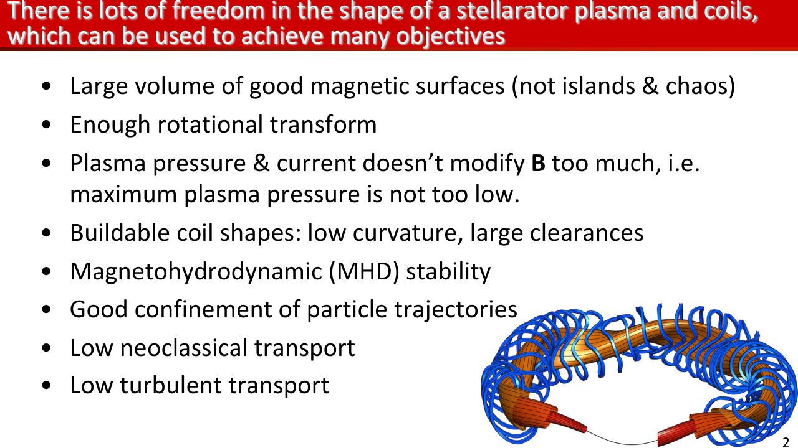
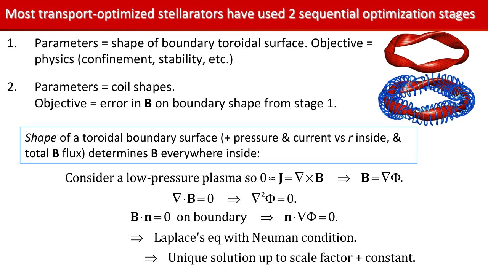
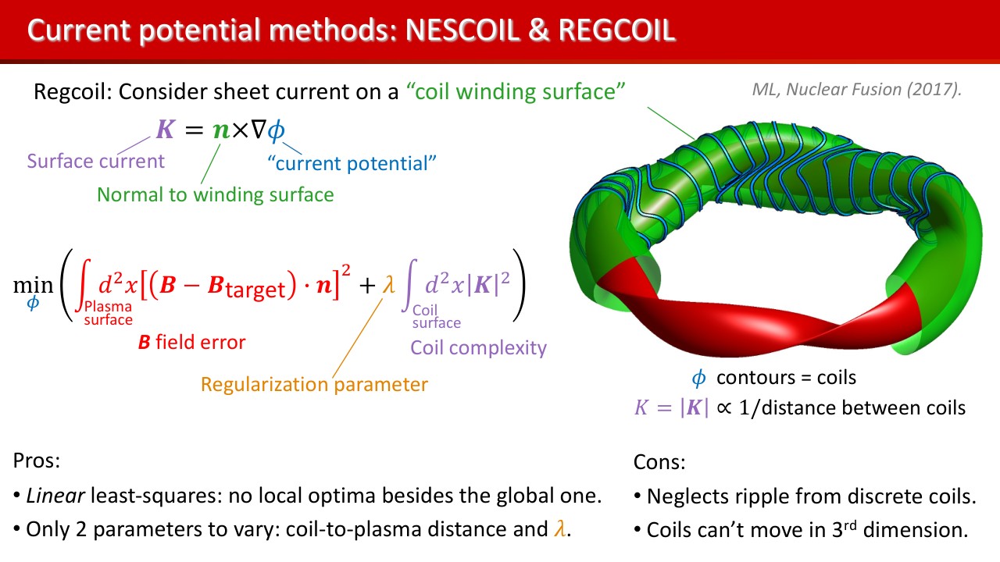
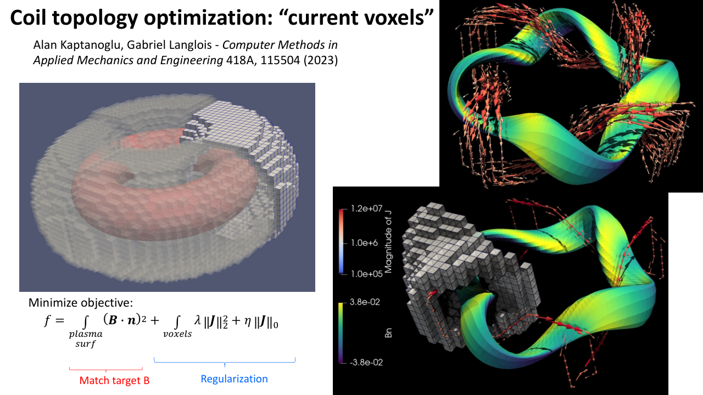
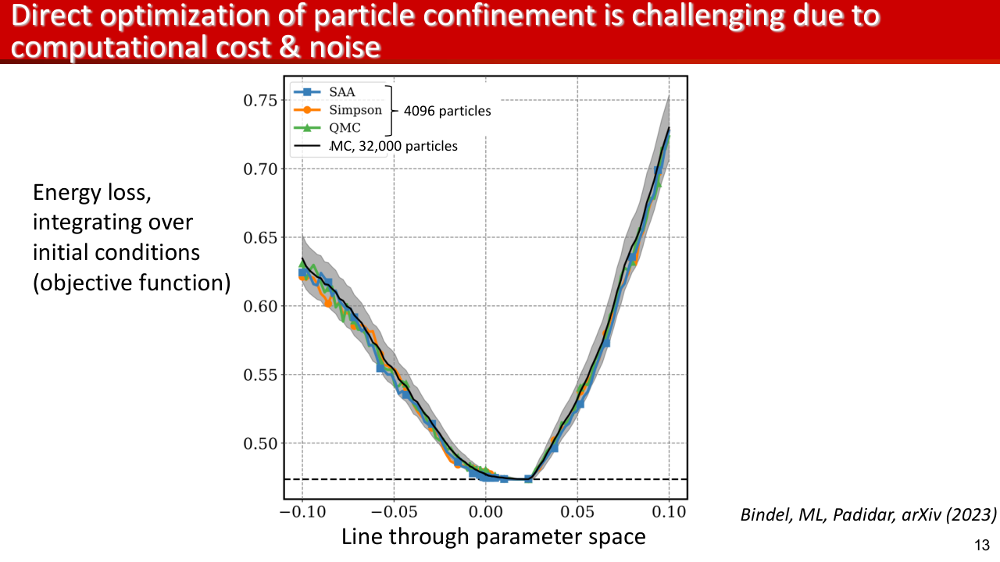
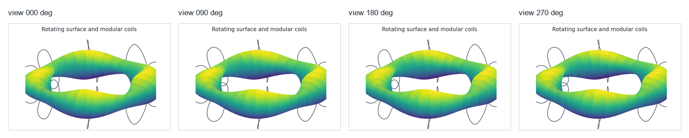
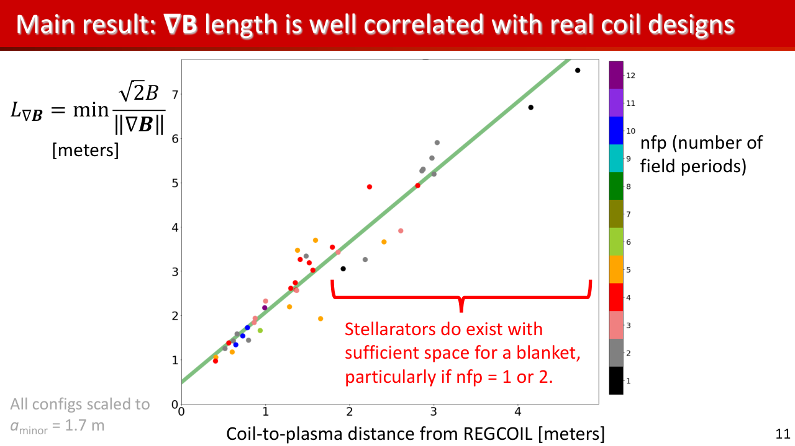

# Can we build the field that we optimized?
Lecture 2: coils, quadratic flux, and single-stage design

- A plasma boundary is a wish; coils are the contract
- Docs: https://sos2026-rjorge-stellarator-optimization.readthedocs.io/

---

# PART 1. The coil inverse problem
- Stage 1 gives a target surface
- Stage 2 asks hardware to reproduce it

---

# Never show a beautiful plasma without its coils
- The engineering contract starts at B dot n

---

# Main ideas for Lecture 2
| Main idea | What students should be able to say |
|---|---|
| Stage 2 | Given a target surface, find modular coils whose Biot-Savart field has small B dot n. |
| Regularization | Length, curvature, spacing, ports, and robustness are objective terms, not afterthoughts. |
| Single stage | Move the plasma target and the coils together when the separated problem is too restrictive. |
| Validation | A coil set should be judged by field quality, engineering scale, and particle/field-line diagnostics. |

_The reference talks move from a target plasma to coils quickly; this lecture follows that same path._

---

# Plasma and coil shapes share the design freedom

- Good surfaces
- Enough transform
- Buildable coils
- Low transport

_This is the compact motivation for a multiobjective stellarator design loop._

<small>Source visual: Landreman, Charkiw Stellarator Optimization Lectures, slide 2.</small>

---

# Optimization is organized by what is allowed to move
- Stage 1: VMEC or DESC moves the plasma target
- Stage 2: SIMSOPT or coil-design codes move the coils around that target
- Single stage: the target and coils move together under physics and engineering penalties

---

# Codes used in this lecture
| Code | What it does here |
|---|---|
| SIMSOPT | Build the objective graph: VMEC coupling, surfaces, curves, Biot-Savart fields, and stage-2 coil penalties. |
| NESCOIL / REGCOIL | Current-potential and regularized coil-design baselines; useful for explaining the inverse problem. |
| FOCUS / QUADCOIL | Alternative coil optimization families for comparing field quality and engineering constraints. |
| ESSOS | JAX fieldline, particle, and coil workflows for direct diagnostics and gradient experiments. |
| VMEC / DESC | Provide the target surface when the plasma boundary is allowed to move. |

_A modern coil lecture should name the tools and the object each one controls._

<small>Code references: SIMSOPT JOSS 6, 3525 (2021); NESCOIL, REGCOIL, FOCUS, QUADCOIL, ESSOS, DESC.</small>

---

# Two-stage design is useful but incomplete

- Stage 1 chooses the target plasma
- Stage 2 tries to realize the field
- Single-stage methods couple the two

_The transition into single-stage optimization starts from this historical compromise._

<small>Source visual: Landreman, Charkiw Stellarator Optimization Lectures, slide 9.</small>

---

# What is a modular coil set?
- **Term:** Modular coils
- **Definition:** A set of separate closed coils placed around the torus, each shaped to reproduce the target magnetic surface.
- **Equation:** min  ∫ |B · n|^2 dA  + engineering penalties
- **Physical meaning:** The loops are hardware objects: length, curvature, separation, ports, and tolerance matter.
- **Optimizer sees:** Move coil control points while measuring normal-field error and engineering regularization.
- **Failure mode:** A coil set can reproduce the surface mathematically while being too complex or too close to the plasma.
- **Remember:** The field is credible only when the coil geometry is credible.

<small>Refs: SIMSOPT JOSS 6, 3525 (2021); Giuliani et al., JCP 459, 111147 (2022).</small>

---

# Single-stage changed the controlled object
- Two-stage: choose a plasma boundary first, then ask coils to reproduce it
- Fixed-boundary single-stage: boundary and coils move together through a quadratic-flux penalty
- Simplified coils: few-coil designs become searchable, but engineering gates still decide viability

<small>Refs: Jorge et al., PPCF 65, 074003 (2023); Jorge, Giuliani & Loizu, arXiv:2406.07830 (2024); Giuliani et al., JCP 459, 111147 (2022).</small>

---

# Initial coils define the first mismatch

- Look for scale, symmetry, and crowding
- The loops represent modular coil degrees of freedom

_The first coil set shows the inverse problem before regularization._

---

# Final coils reduce the obvious mismatch

- Compare shape and smoothness
- Then ask whether access and curvature remain acceptable

_A better coil picture is still not a manufacturability proof._

<small>Ref: SIMSOPT, Landreman et al., JOSS 6, 3525 (2021).</small>

---

# What does B dot n measure?
- **Term:** Normal-field error
- **Definition:** The component of the coil-produced magnetic field that crosses the target plasma boundary.
- **Equation:** B · n = 0 on the target surface
- **Physical meaning:** If B dot n is large, field lines pierce the intended boundary instead of staying tangent to it.
- **Optimizer sees:** Stage-2 optimization drives the normal-field error down while respecting coil complexity.
- **Failure mode:** A small B dot n can still hide current, clearance, tolerance, or maintenance problems.
- **Remember:** B dot n is the first coil score; it is not the last engineering score.

<small>Ref: SIMSOPT stage-two coil optimization workflow.</small>

---

# B dot n is the basic stage-2 score

- Blue/red patches show normal-field error
- The target surface is damaged when patches remain

_Quadratic flux measures whether coils reproduce the requested boundary._

<small>Ref: SIMSOPT docs stage-two coil optimization example.</small>

---

# Regularization trades field quality for hardware

- Shorter coils can make B dot n worse
- A single optimum hides the engineering choice

_The annotation marks what gets worse when coils are pushed too hard._

---

# Coil complexity has multiple dimensions
- Length: cost, maintenance, and access
- Curvature: force and strain risk
- Separation: ports and assembly constraints

---

# Current-potential methods expose coil regularization

- Surface current is the optimization variable
- Regularization controls complexity
- Contours become coils

_Use this when explaining why low B dot n is not the only engineering objective._

<small>Source visual: Landreman, Charkiw Stellarator Optimization Lectures, slide 39.</small>

---

# Topology can be a design variable

- Do not assume the number of coils
- Regularization defines what is buildable
- Topology search still needs engineering gates

_The coil problem can move beyond smoothing a fixed set of curves._

<small>Source visual: Simons/Maryland Hidden Symmetries overview, 2024, slide 6.</small>

---

# Ports and maintenance enter early
- Access can invalidate attractive coil sets
- Use engineering constraints as penalties or hard gates

---

# Demo break: SIMSOPT stage-2 coils

- Compare initial and final coils
- Plot B dot n maps
- Name the tradeoff

_Notebook path: notebooks/04_simsopt_stage2_coils.ipynb_

---

# PART 2. Direct optimization
- Move field, particles, and coils in the same loop
- Use differentiable codes where the gradient is meaningful

---

# Direct particle objectives are honest but noisy

- Optimize the quantity that matters
- Expect stochastic-looking landscapes
- Use cheap screens before expensive calls

_Direct optimization is attractive because the metric is physical; it is hard because the landscape is rough._

<small>Source visual: Landreman UMD numerical-analysis seminar, 2023, slide 13.</small>

---

# Fieldlines diagnose topology

- Good surfaces support the coil story
- Bad topology catches failures a scalar may miss

_The fieldline is a topology diagnostic; particle confinement needs a separate check._

---

# Particles answer a different question

- Fieldlines do not guarantee confinement
- Fast-particle gates matter for reactors

_Orbit cartoons teach why particle objectives can enter directly._

---

# Animation storyboard: rotating surface and modular coils

- Use the four views to explain modular-coil clearance
- Emphasize that coils and surface must be judged together

_Static storyboard for reliable projection; the movie file remains in the repo._

---

# Single-stage design keeps coils in the loop
- Boundary variables and coil variables move together
- The objective includes plasma metrics, flux error, and coil metrics

<small>Ref: Jorge et al., PPCF 65, 074003 (2023), single-stage fixed-boundary/coils workflow.</small>

---

# Continuation makes the negotiation visible

- Watch objective terms decrease together
- Stop when one term dominates the story

_A coupled objective is a trace, not just a final number._

---

# Weights reveal which constraint is active

- Increase the coil penalty and watch which design quality is traded away

_Weight scans are design arguments._

---

# Demo break: fieldlines and single-stage toy

- Change one weight
- Run the reference diagnostics
- Defend the result

_Notebook path: notebooks/05_single_stage_toy.ipynb + notebooks/06_essos_fieldlines_particles.ipynb_

---

# Autodiff still needs validation
- A gradient is a derivative of the implemented model
- The implemented model still has a validity domain
- Finite differences remain a check

---

# Robustness is a stage-2 metric
- Manufacturing errors: sensitivity to shape perturbations
- Current perturbations: sensitivity to power-supply changes
- Maintenance tolerance: clearance, curvature, and access

---

# Coil feasibility has a magnetic scale length

- Small scale lengths demand close coils
- Close coils reduce access and tolerance
- The metric connects physics to hardware

_This is a stronger explanation of why modular-coil design needs geometric scale diagnostics._

<small>Source visual: Landreman et al., APS-DPP theory supporting FPP talk, 2023, slide 11.</small>

---

# Lecture 2 what to remember
- Stage 2 turns a field design into hardware
- Coil regularization is part of the objective
- Single-stage optimization changes the tradeoff surface
- Test engineering as a gate

---

# Simple coils far away from the plasma are difficult to find
- That sentence is an optimization problem

---

# APPENDIX. Lecture 2 checks and replacements
- Use this section when SIMSOPT or ESSOS is available
- Keep reference figures for lecture timing

---

# Stage-2 objective terms
- Normal-field error: does the coil set reproduce the target?
- Length and curvature: can the coil be built and maintained?
- Separation and access: can the device be assembled and diagnosed?

---

# SIMSOPT package path
- Load the public QA target
- Build curves and Biot-Savart fields
- Run a short optimization before class

---

# Fieldlines and particles answer different questions
- Fieldlines: topology and stochasticity
- Particles: alpha-loss and orbit width
- Both: rerun after coil changes

---

# Single-stage acceptance checks
- The plasma metric improves without hiding coil complexity
- The coil metric improves without destroying confinement metrics
- The combined gradient passes a finite-difference check

---

# Reference figure: initial coils

- Use to explain the starting point
- Ask what makes the target hard

---

# Reference figure: final coils

- Use to explain the claimed improvement
- Ask what still needs engineering checks

---

# Reference figure: particle orbit

- Use if a particle trace is unavailable
- Connect orbit loss to reactor gates

---

# Coil robustness outputs to track
- Shape perturbations: sensitivity of B dot n
- Current errors: sensitivity of flux surfaces
- Mechanical tolerance: clearance, curvature, access

---

# Discussion: can a coil set win with the wrong metric?
- Lower B dot n: can come with high curvature
- Smoother coils: can miss the target boundary
- First experiment: needs both magnetic accuracy and engineering margin

---

# What to remember
- Keep the scientific object and the computed artifact together
- Rerun, perturb, compare, and explain before trusting the optimum
- Docs: https://sos2026-rjorge-stellarator-optimization.readthedocs.io/
