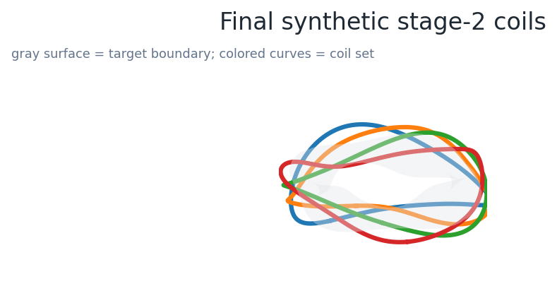
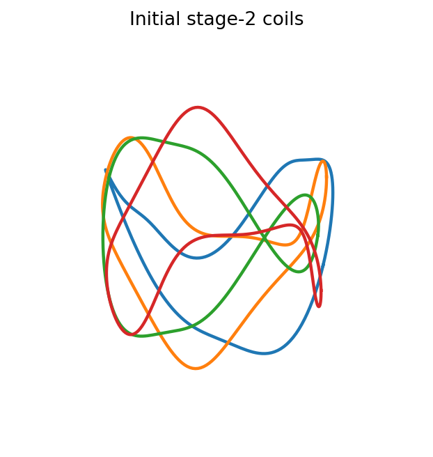
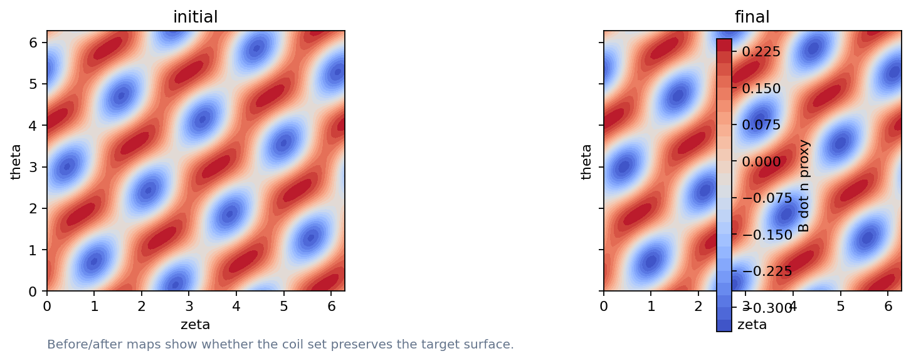
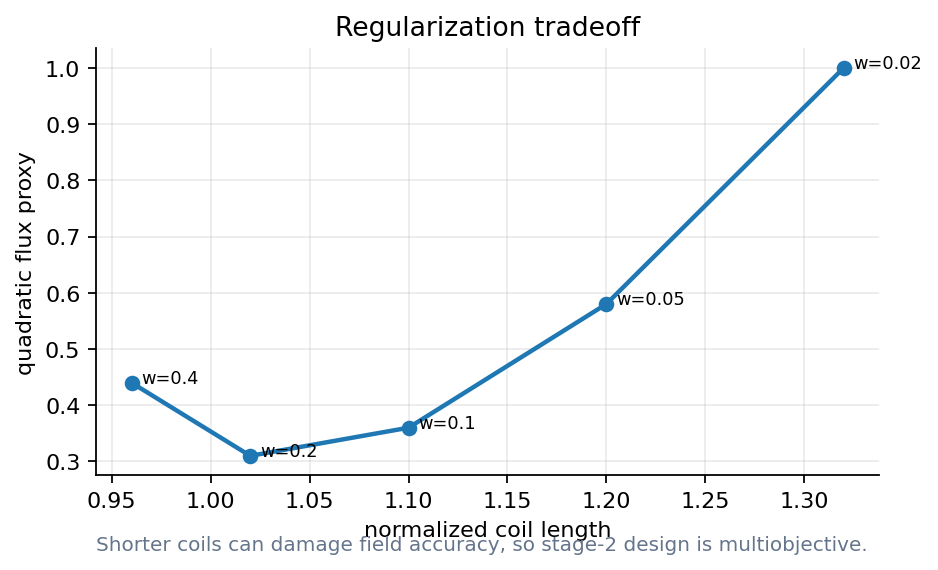
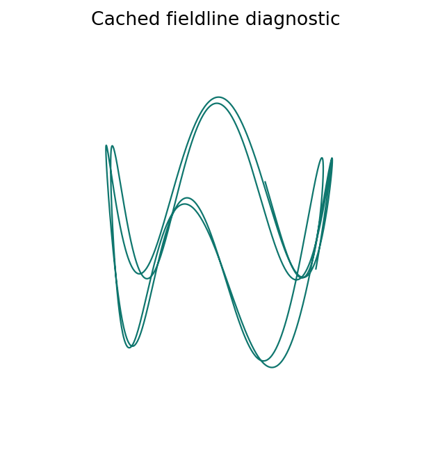
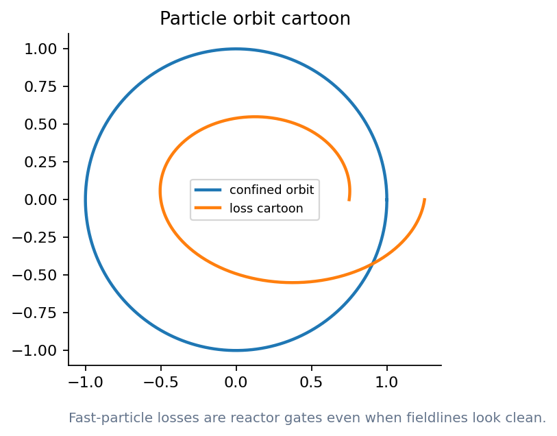
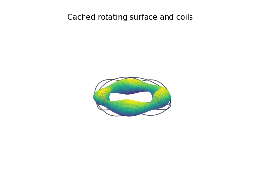
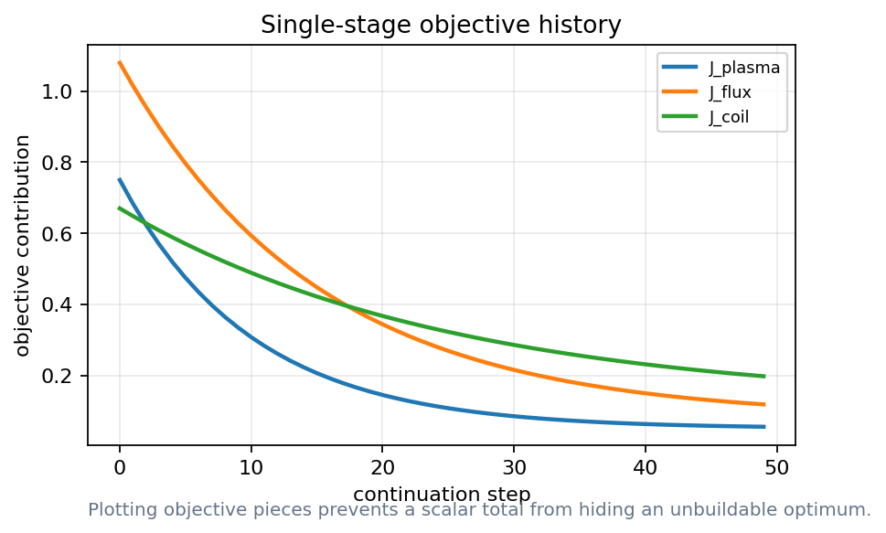
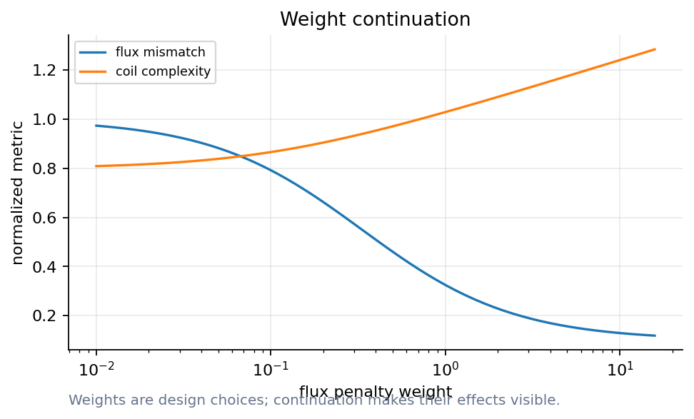

# Can we build the field that we optimized?

Lecture 2: coils, quadratic flux, and single-stage design

- A plasma boundary is a wish; coils are the contract
- Docs: https://sos2026-rjorge-stellarator-optimization.readthedocs.io/

---

# PART 1. The coil inverse problem
- Stage 1 gives a target surface
- Stage 2 asks hardware to reproduce it

---

# Never show a beautiful plasma without its coils
- The engineering contract starts at B dot n

---

# Stage 1, stage 2, single stage
- Stage 1: optimize the plasma target
- Stage 2: fit coils to that target
- Single stage: move plasma and coils together

---

# Initial coils are a diagnostic, not an answer

- Look for scale, symmetry, and crowding
- The curves are synthetic teaching coils

_The first coil set shows the inverse problem before regularization._

---

# Final coils reduce the obvious mismatch

- Compare shape and smoothness
- Then ask whether access and curvature remain acceptable

_A better coil picture is still not a manufacturability proof._

---

# B dot n is the basic stage-2 score

- Blue/red patches show normal-field error
- The target surface is damaged when patches remain

_Quadratic flux measures whether coils reproduce the requested boundary._

---

# Regularization trades field quality for hardware

- Shorter coils can make B dot n worse
- A single optimum hides the engineering choice

_The annotation marks what gets worse when coils are pushed too hard._

---

# Coil complexity has multiple dimensions
- Length: cost, maintenance, and access
- Curvature: force and strain risk
- Separation: ports and assembly constraints

---

# Ports and maintenance enter early
- Access can invalidate attractive coil sets
- Use engineering constraints as penalties or hard gates

---

# Demo break: SIMSOPT stage-2 coils

`notebooks/04_simsopt_stage2_coils.ipynb`
- Compare initial and final coils
- Plot B dot n maps
- Name the tradeoff

_Cached mode first. Repo: https://github.com/rogeriojorge/sos2026-rjorge-stellarator-optimization | Docs: https://sos2026-rjorge-stellarator-optimization.readthedocs.io/_

---

# PART 2. Direct optimization
- Move field, particles, and coils in the same loop
- Use differentiable codes where the gradient is meaningful

---

# Fieldlines diagnose topology

- Good surfaces support the coil story
- Bad topology catches failures a scalar may miss

_This cached fieldline is a qualitative diagnostic, not a live ESSOS run._

---

# Particles answer a different question

- Fieldlines do not guarantee confinement
- Fast-particle gates matter for reactors

_Orbit cartoons teach why particle objectives can enter directly._

---

# Movie: rotating surface and coils

- Play rotating_surface.gif during class
- Use the first frame in static slides

_Use the GIF live; use this first-frame PNG when PowerPoint is static._

---

# Single-stage design keeps coils in the loop
- Boundary variables and coil variables move together
- The objective includes plasma metrics, flux error, and coil metrics

---

# Continuation makes the negotiation visible

- Watch objective terms decrease together
- Stop when one term dominates the story

_A coupled objective is a trace, not just a final number._

---

# Weights reveal which constraint is active

- Increasing one weight can improve one metric and hurt another
- This is the classroom Pareto intuition

_Weight scans are design arguments._

---

# Demo break: fieldlines and single-stage toy

`notebooks/05_single_stage_toy.ipynb + notebooks/06_essos_fieldlines_particles.ipynb`
- Change one weight
- Run cached diagnostics
- Defend the result

_Cached mode first. Repo: https://github.com/rogeriojorge/sos2026-rjorge-stellarator-optimization | Docs: https://sos2026-rjorge-stellarator-optimization.readthedocs.io/_

---

# Autodiff still needs validation
- A gradient is a derivative of the implemented model
- The implemented model still has a validity domain
- Finite differences remain a check

---

# Robustness is a stage-2 metric
- Manufacturing errors: sensitivity to shape perturbations
- Current perturbations: sensitivity to power-supply changes
- Maintenance tolerance: clearance, curvature, and access

---

# Lecture 2 what to remember
- Stage 2 turns a field design into hardware
- Coil regularization is part of the objective
- Single-stage optimization changes the tradeoff surface
- Test engineering as a gate

---

# Simple coils far away from the plasma are difficult to find
- That sentence is an optimization problem

---

# APPENDIX. Lecture 2 checks and replacements
- Use this section when SIMSOPT or ESSOS is available
- Keep cached images for lecture timing

---

# Stage-2 objective terms
- Normal-field error: does the coil set reproduce the target?
- Length and curvature: can the coil be built and maintained?
- Separation and access: can the device be assembled and diagnosed?

---

# SIMSOPT research path
- Load the public QA target
- Build curves and Biot-Savart fields
- Run a short optimization before class

---

# Fieldlines and particles answer different questions
- Fieldlines: topology and stochasticity
- Particles: alpha-loss and orbit width
- Both: rerun after coil changes

---

# Single-stage acceptance checks
- The plasma metric improves without hiding coil complexity
- The coil metric improves without destroying confinement metrics
- The combined gradient passes a finite-difference check

---

# Backup figure: initial coils

- Use to explain the starting point
- Ask what makes the target hard

---

# Backup figure: final coils

- Use to explain the claimed improvement
- Ask what still needs engineering checks

---

# Backup figure: particle orbit

- Use if a particle trace is unavailable
- Connect orbit loss to reactor gates

---

# Coil robustness outputs to track
- Shape perturbations: sensitivity of B dot n
- Current errors: sensitivity of flux surfaces
- Mechanical tolerance: clearance, curvature, access

---

# Discussion: can a coil set win with the wrong metric?
- Lower B dot n: can come with high curvature
- Smoother coils: can miss the target boundary
- First experiment: needs both magnetic accuracy and engineering margin

---

# What to remember
- Keep the scientific object and the computed artifact together
- Rerun, perturb, compare, and explain before trusting the optimum
- Docs: https://sos2026-rjorge-stellarator-optimization.readthedocs.io/

---
