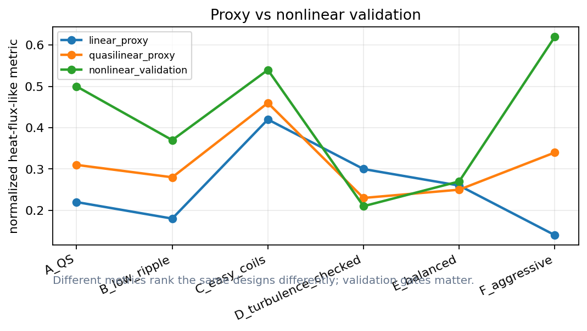
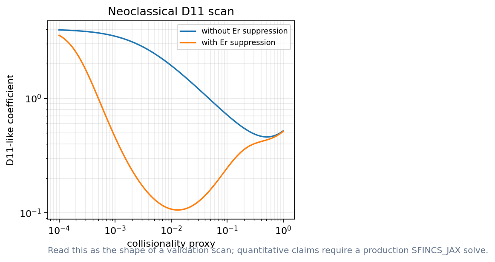
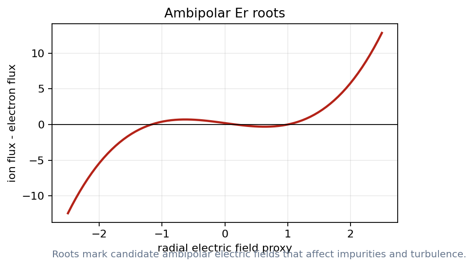
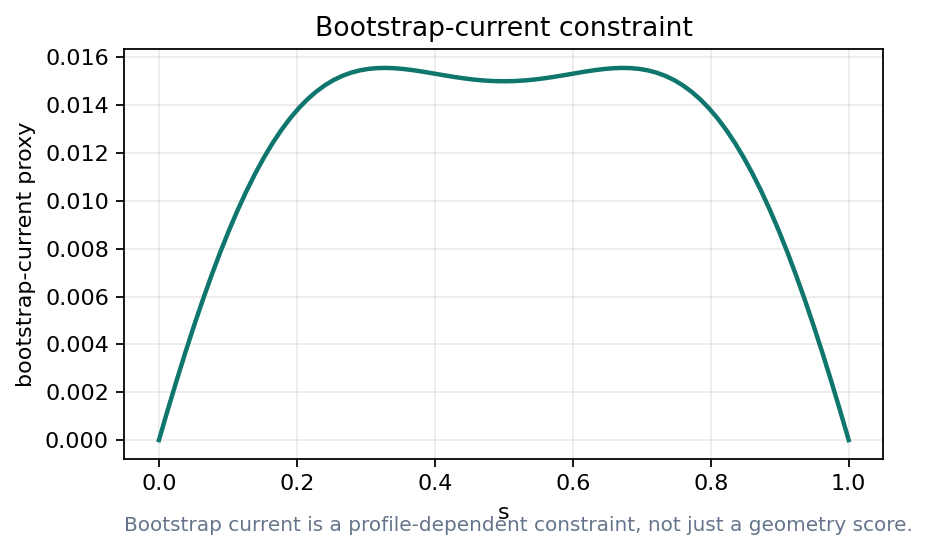
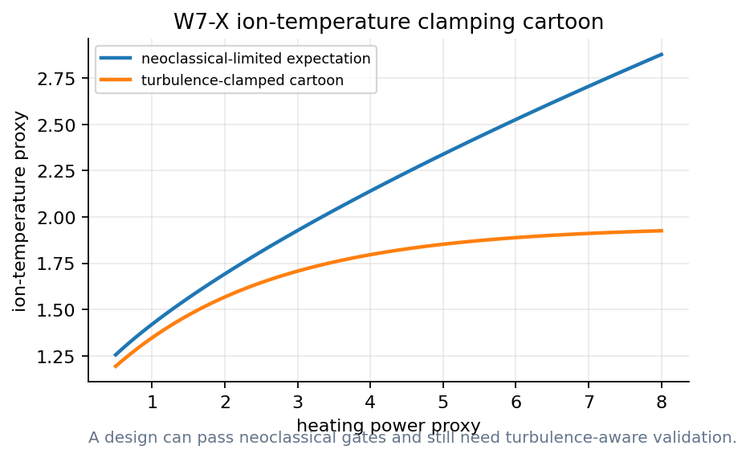
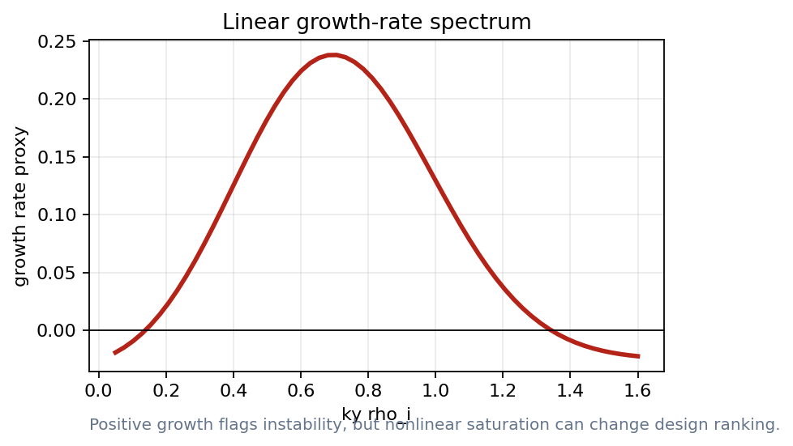
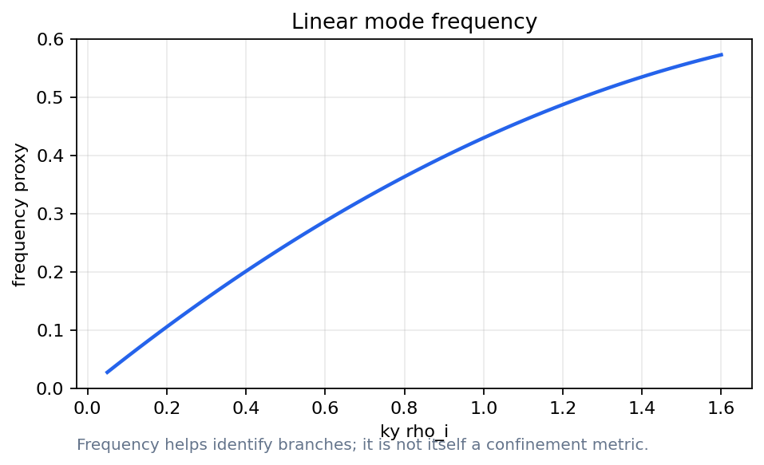

# What should go into the objective function?
Lecture 3: neoclassical, turbulence, and fast-particle gates

- Can transport physics become an optimization metric?
- Docs: https://sos2026-rjorge-stellarator-optimization.readthedocs.io/

---

# PART 1. A hierarchy of transport calculations
- Cheap screens move many designs
- Expensive calculations validate finalists

---

# What is neoclassical transport?
- **Term:** Neoclassical transport
- **Definition:** Collisional transport caused by guiding-center drifts in a toroidal magnetic field with trapped particles.
- **Equation:** Gamma, Q = functions(geometry, nu, E_r, profiles)
- **Physical meaning:** It is geometry sensitive, especially in stellarators, and can be reduced by optimization.
- **Optimizer sees:** Use cheap geometry metrics first, then drift-kinetic validation for finalists.
- **Failure mode:** The result depends on collisionality, radial electric field, species, and profiles.
- **Remember:** Neoclassical metrics are geometry gates with plasma-state assumptions.

<small>Refs: Helander RPP 77, 087001 (2014); Beidler et al., Nature 596, 221-226 (2021).</small>

---

# The optimizer follows the metric we choose
- Metric design is part of physics

---

# Cost hierarchy for transport metrics
- Geometry metrics: fastest screens
- Effective ripple and Boozer metrics: early transport warnings
- DKE, gyrokinetics, particles, profiles: validation gates

---

# Transport literature says: validate the winner
- W7-X: neoclassical optimization reduced the geometry-driven loss channel
- SFINCS: drift-kinetic validation depends on trajectory, electric-field, and collision modeling choices
- Nonlinear turbulence: heat-flux objectives can be noisy enough to need stochastic or staged optimization

<small>Refs: Beidler et al., Nature 596, 221-226 (2021); Landreman et al., Phys. Plasmas 21, 042503 (2014); Kim et al., JPP 90, 905900203 (2024).</small>

---

# Effective ripple is a neoclassical screen

- Rank candidates before expensive runs
- Do not treat the scalar as the whole transport story

_These curves show how the screen should be read; full transport validation remains a separate step._

---

# What is D11?
- **Term:** D11 transport coefficient
- **Definition:** A radial particle-transport coefficient from the drift-kinetic response, often scanned versus collisionality.
- **Equation:** Gamma_1 = - n D_11 (d ln n / dr + ...)
- **Physical meaning:** It tells how strongly particles diffuse radially for a given thermodynamic drive.
- **Optimizer sees:** Use D11 scans to test whether a low-ripple design remains good under richer kinetic physics.
- **Failure mode:** A single D11 curve is not a full flux prediction without Er, sources, profiles, and species choices.
- **Remember:** D11 is a validation coefficient, not a universal confinement number.

<small>Ref: Landreman et al., Phys. Plasmas 21, 042503 (2014).</small>

---

# D11 scans add richer validation

- Collisionality changes the answer
- Er suppression changes the interpretation

_Read the slope, the electric-field suppression, and the collisionality window._

<small>Ref: Landreman et al., Phys. Plasmas 21, 042503 (2014), SFINCS drift-kinetic solver.</small>

---

# Ambipolar roots are not always unique

- Multiple roots imply multiple regimes
- Optimization needs a root-choice rule

_The root structure is the lesson; the numbers are not a live SFINCS result._

---

# Bootstrap current feeds back on equilibrium

- Bootstrap current can alter transform and islands
- Profile dependence enters early

_Transport outputs become equilibrium inputs._

---

# W7-X lesson for optimizers
- Neoclassical optimization: reduced radial losses
- Ion-temperature clamping: turbulence bottleneck
- Profiles: decide whether the metric matters experimentally

---

# Neoclassical success can expose turbulence

- The blue expectation keeps rising
- The orange curve saturates

_The cartoon motivates turbulence-aware validation without rederiving transport theory._

<small>Ref: Beidler et al., Nature 596, 221-226 (2021); W7-X ion-temperature clamping literature.</small>

---

# Demo break: neoclassical validation

- Read a collisionality scan
- Inspect Er roots
- Plot bootstrap feedback

_Notebook 07: SFINCS-style neoclassical validation._

---

# PART 2. Turbulence metrics
- Linear calculations are early screens
- Nonlinear validation changes rankings

---

# What is turbulent transport?
- **Term:** Turbulent transport
- **Definition:** Radial heat and particle transport driven by microinstabilities and nonlinear fluctuations.
- **Equation:** Q_turb ~ <delta v_E · delta p>
- **Physical meaning:** It can dominate after neoclassical losses are reduced, as seen in W7-X temperature-clamping discussions.
- **Optimizer sees:** Start with linear or proxy metrics, then validate finalists with nonlinear heat-flux calculations.
- **Failure mode:** Linear growth rates can rank designs differently from nonlinear heat flux.
- **Remember:** A transport optimizer must survive both neoclassical and turbulence gates.

<small>Ref: Kim et al., J. Plasma Phys. 90, 905900203 (2024).</small>

---

# Linear growth is a fast warning

- Positive growth marks unstable branches
- The peak is not the heat flux

_Use growth rate as a screen, not as the final objective._

<small>Ref: SPECTRAX-GK PyPI/docs, JAX-native gyrokinetic solver for stellarator optimization workflows.</small>

---

# What are growth rate and frequency?
- **Term:** Linear gyrokinetic spectrum
- **Definition:** The growth rate says whether a mode amplifies; the frequency helps identify the branch.
- **Equation:** omega = omega_r + i gamma
- **Physical meaning:** Positive gamma marks an unstable mode, but the nonlinear saturated flux is a separate result.
- **Optimizer sees:** Use spectra as fast screens and branch diagnostics before nonlinear validation.
- **Failure mode:** A design with a lower peak gamma can still have worse nonlinear heat flux.
- **Remember:** Linear spectra are warning lights; nonlinear flux is the stronger gate.

<small>Ref: SPECTRAX-GK public package notes and nonlinear turbulence optimization literature.</small>

---

# Frequency helps identify the branch

- Growth and frequency belong together
- The sign and trend help classify modes

_Frequency is diagnostic context, not the scalar objective._

---

# A proxy can pick the wrong winner

- Red circle: proxy winner
- Green circle: validation winner

_The ranking failure is the point of the plot._

<small>Ref: Kim et al., J. Plasma Phys. 90, 905900203 (2024), nonlinear turbulence optimization with noisy heat fluxes.</small>

---

# Demo break: turbulence proxy versus validation

- Choose the proxy winner
- Compare validation ranking
- Explain the failure mode

_Notebook path: notebooks/08_spectrax_gk_linear_metric.ipynb + notebooks/09_turbulence_metric_surrogate.ipynb_

---

# PART 3. Fast particles are reactor gates
- Alpha confinement, wall loads, and orbit classes matter
- Particle metrics must rerun after coil changes

---

# Particle metrics connect back to coils

- A fieldline picture can look acceptable
- An orbit diagnostic can still fail

_Fast-particle checks belong in the validation ladder._

---

# Validation compares failure modes
- Does the metric fail on a known bad design?
- Does it rank a known good design correctly?
- Does it change smoothly under perturbations?

---

# Metric trust ladder
- Screen: reduced model trend
- Ranking hypothesis: fast or quasilinear run
- Validation: expensive run or experimental comparison

---

# Lecture 3 what to remember
- Use cheap metrics to steer the search
- Use expensive metrics to challenge finalists
- Plot profiles and regimes
- Never hide proxy failure

---

# Transport metrics are validation gates
- A good design survives a stronger metric

---

# APPENDIX. Lecture 3 checks and replacements
- Use this section when SFINCS, SPECTRAX, or particle tools are live
- Keep reference ranking plots ready

---

# Neoclassical outputs to track
- Effective ripple: low-collisionality screen
- Ambipolar roots: radial electric-field validation
- Bootstrap current: profile-dependent equilibrium feedback

---

# Turbulence outputs to track
- Linear growth rate: fast instability screen
- Quasilinear weight: ranking hypothesis
- Nonlinear heat flux: validation for finalists

---

# Research path: NEO_JAX and SFINCS_JAX
- Choose the same equilibrium and flux surface
- Scan collisionality and radial electric field
- Compare compact metrics before detailed validation

---

# Research path: SPECTRAX-GK
- Start with a short linear calculation
- Plot growth rate and frequency versus ky
- Keep nonlinear validation gate explicit

---

# How to read a fast metric
- Growth rate screens instability before heat-flux validation
- A scalar ripple value should point back to where losses occur
- A profile proxy should lead to a solved discharge model

---

# Reference figure: growth-rate spectrum

- Use if a live linear run is slow
- Ask what the scalar should be

---

# Reference figure: W7-X clamping cartoon

- Use to motivate turbulence after neoclassical success
- Keep the cartoon label visible

---

# Before showing a transport number
- Equilibrium: which surface and assumptions?
- Kinetics: which species and collisionality?
- Validation: which expensive calculation confirms it?

---

# Discussion: what can reverse the ranking?
- Neoclassical winner: can lose on turbulence
- Turbulence winner: can fail alpha confinement
- Profile change: can move both metrics together

---

# What to remember
- Keep the scientific object and the computed artifact together
- Rerun, perturb, compare, and explain before trusting the optimum
- Docs: https://sos2026-rjorge-stellarator-optimization.readthedocs.io/
