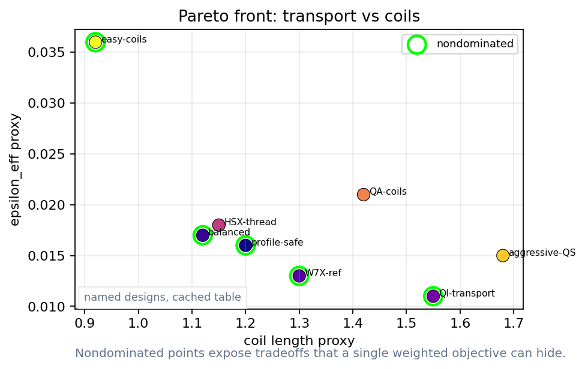
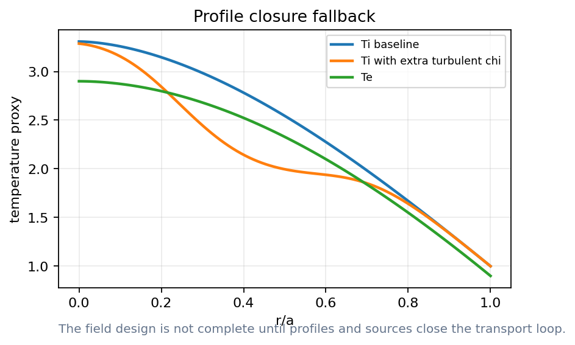
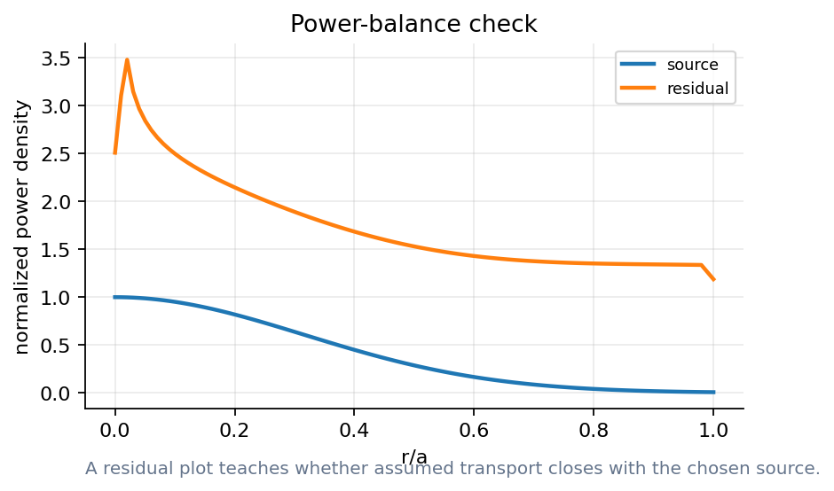
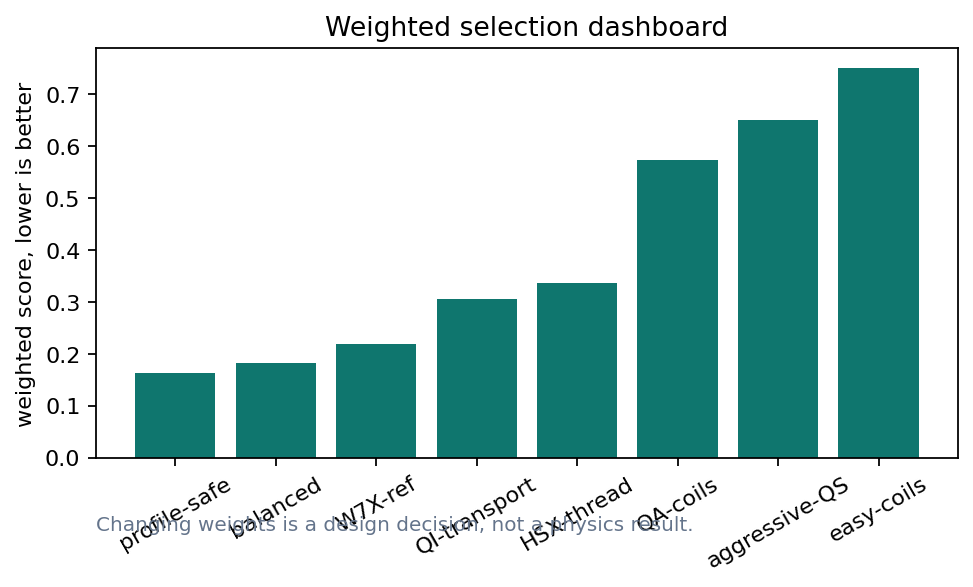
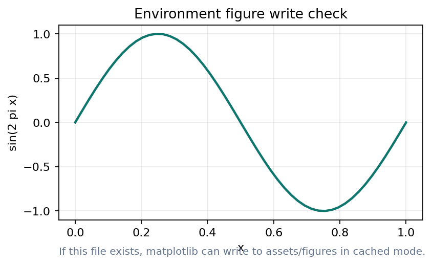
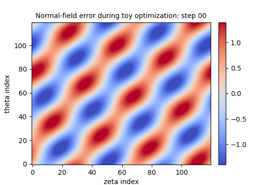

# When does an optimized field become a reactor design?

Lecture 4: profiles, Pareto decisions, and the repo lab

- A design is not a shape; it is a validated workflow
- Docs: https://sos2026-rjorge-stellarator-optimization.readthedocs.io/

---

# The full loop has memory
- Geometry changes transport
- Transport changes profiles
- Profiles change objectives

---

# PART 1. Close the loop with profiles
- Field optimization changes transport
- Transport changes pressure and current

---

# Profiles turn a field optimum into a scenario

- Temperature and density gradients drive transport
- A good field metric can underperform after closure

_This fallback model teaches profile feedback, not a live NEOPAX result._

---

# Power balance is a credibility check

- Sources, fluxes, and residuals must match
- A post-hoc residual is weak evidence

_A design claim needs a solved balance, not only a field metric._

---

# Integrated objectives should be staged
- Early: cheap geometry and Boozer screens
- Middle: coils and neoclassical metrics
- Late: turbulence, particles, profiles, engineering

---

# Demo break: profile closure

`notebooks/10_neopax_profile_closure.ipynb`
- Plot temperature response
- Inspect power balance
- Say what remains cached

_Cached mode first. Repo: https://github.com/rogeriojorge/sos2026-rjorge-stellarator-optimization | Docs: https://sos2026-rjorge-stellarator-optimization.readthedocs.io/_

---

# PART 2. Pareto decisions
- Many designs can be defensible
- The decision weights must be explicit

---

# Reactor constraints enter as gates
- Alpha heating and losses: reactor-relevant loss gate
- Wall loads and blankets: engineering and material constraint
- Maintenance and access: device availability constraint

---

# Pareto fronts need interpretation

- Nondominated points still require priorities
- Final choice needs context and validation

_A Pareto front is an argument surface, not an automatic answer._

---

# Weights expose the design decision

- Changing weights changes the winner
- Record weights beside every selected design

_A weighted score is a value judgment with units and provenance._

---

# Demo break: Pareto dashboard

`notebooks/11_pareto_design_dashboard.ipynb`
- Change one metric weight
- Regenerate the chart
- Defend the selected design

_Cached mode first. Repo: https://github.com/rogeriojorge/sos2026-rjorge-stellarator-optimization | Docs: https://sos2026-rjorge-stellarator-optimization.readthedocs.io/_

---

# Validation gates prevent metric gaming
- Equilibrium, Boozer, neoclassical, turbulence, particles, profiles, coils, engineering
- A design can pass one gate and fail the next

---

# PART 3. The GitHub repo is the lab manual
- Slides explain concepts
- Notebooks execute projects
- Scripts regenerate figures, movies, and status

---

# A design is not a shape; it is a validated workflow
- The repo is the audit trail

---

# Repo lab flow
- python scripts/check_release_ready.py
- python scripts/make_lecture_bundle.py
- python scripts/audit_notebook_outputs.py

---

# Cached, tiny, and research modes serve different audiences
- cached: student reliability
- tiny: instructor live demo
- research: real-code replacement after timing

---

# ReadTheDocs is the canonical guide
- Docs: https://sos2026-rjorge-stellarator-optimization.readthedocs.io/
- Repo: github.com/rogeriojorge/sos2026-rjorge-stellarator-optimization
- Use the live demo matrix during class

---

# Repo lab: full cached run

`scripts/check_release_ready.py`
- Run acceptance checks
- Review STATUS.md
- Open rendered docs

_Cached mode first. Repo: https://github.com/rogeriojorge/sos2026-rjorge-stellarator-optimization | Docs: https://sos2026-rjorge-stellarator-optimization.readthedocs.io/_

---

# Coil robustness returns in the final workflow
- Manufacturing tolerance: can the design survive perturbations?
- Current errors: can operations maintain the target field?
- Thermal and mechanical deformation: does the coil story remain true?

---

# There is no single best stellarator
- There are only defensible choices with stated priorities

---

# Exercise: change the weights and defend a design

`notebooks/11_pareto_design_dashboard.ipynb`
- Move one weight
- Identify the new winner
- Say which validation gate you now trust less

_Cached dashboard first. Docs: https://sos2026-rjorge-stellarator-optimization.readthedocs.io/_

---

# Documentation is part of reproducibility
- README: how a student starts
- ReadTheDocs: the rendered guide during class
- STATUS.md: what was real, cached, or synthetic

---

# APPENDIX. Lecture 4 checks and replacements
- Use this section before distributing the school bundle
- Keep cached mode honest

---

# What belongs in git
- Small inputs: versioned and documented
- Cached data: labeled educational fallback
- Large outputs: regenerated by scripts and ignored

---

# What stays out of git
- Original package PDFs and PPTX files
- Private screenshots and huge generated media
- Local environments and secrets

---

# STATUS.md anatomy
- Package status: what imported and what was skipped
- Data status: what was real and what was synthetic
- Notebook status: what ran and saved outputs

---

# Live-demo abort criteria
- A package starts compiling during class
- A notebook loses its cached fallback
- A result is numerical but the validation path is missing

---

# Movie: toy optimization history

- Play optimization_history.gif for the loop intuition
- Use first frame for PDF/static review

_Use the GIF live; use this first-frame PNG when PowerPoint is static._

---

# Manual steps before the school
- Choose the lecture machine and environment
- Pre-fetch equilibria and verify notebooks render
- Freeze the branch or tag used for the school

---

# How students should use the repo after school
- Start cached: reproduce every figure
- Change one notebook at a time
- Keep generated outputs small and documented

---

# Backup figure: profile closure

- Use if live profile closure fails
- Keep the cached limitation explicit

_Fallback plot for profile closure discussion._

---

# Backup figure: Pareto front

- Use if dashboard edits run long
- Ask which design the room would defend

_Fallback plot for design-decision discussion._

---

# Final design commandments
- Show every boundary with its coil story
- State the validation domain for every metric
- Pair each proxy with its failure mode
- Show the weights behind each Pareto choice

---

# Coupled, differentiable, reproducible stellarator design
- Field, coils, transport, profiles, and decisions in one auditable loop

---

# What to remember
- Keep the scientific object and the computed artifact together
- Rerun, perturb, compare, and explain before trusting the optimum
- Docs: https://sos2026-rjorge-stellarator-optimization.readthedocs.io/

---
