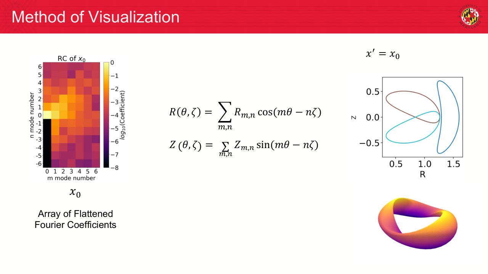
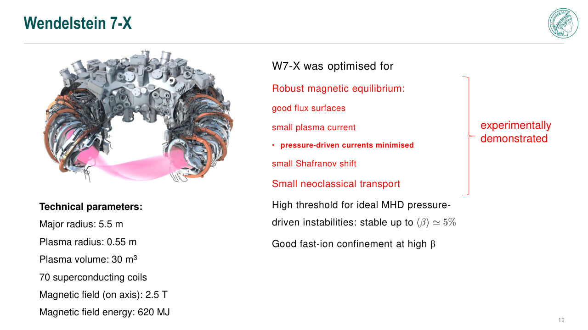
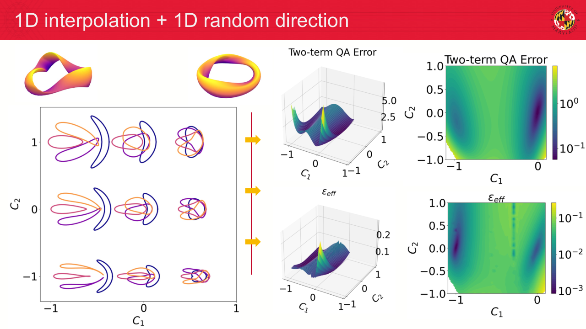
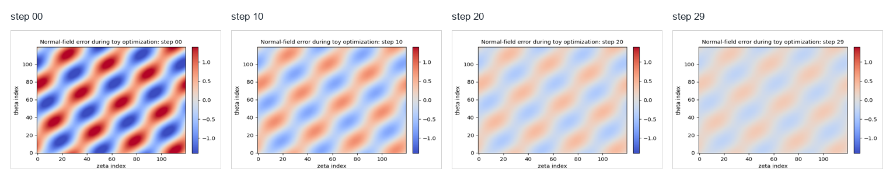
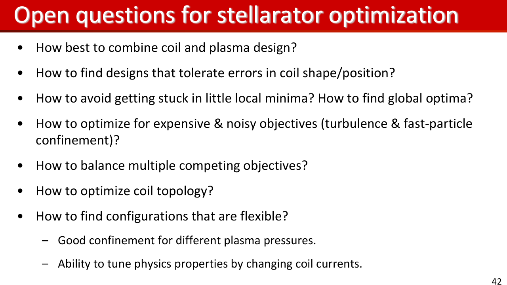

# When does an optimized field become a reactor design?
Lecture 4: profiles, Pareto decisions, and the repo lab

- A design becomes credible when the workflow is validated
- Docs: https://sos2026-rjorge-stellarator-optimization.readthedocs.io/

---

# The full loop has memory
- Geometry changes transport
- Transport changes profiles
- Profiles change objectives

---

# What is profile closure?
- **Term:** Profile closure
- **Definition:** Solving whether sources, sinks, transport coefficients, and radial gradients produce consistent temperature and density profiles.
- **Equation:** source - div(Q_neo + Q_turb) = 0
- **Physical meaning:** The same magnetic geometry can look different once profiles and heating are allowed to respond.
- **Optimizer sees:** Use profile closure near the end of the loop to test the design scenario, not only the vacuum field.
- **Failure mode:** A geometry-only winner can lose when profile stiffness or power balance is included.
- **Remember:** A reactor design is a field plus a self-consistent plasma scenario.

<small>Refs: nonlinear turbulence optimization and integrated transport validation workflows.</small>

---

# Modern workflows are multi-fidelity by design
- SIMSOPT: objective terms, geometry objects, and coils live in one optimization framework
- JAX transport tools: differentiable metrics are useful only inside a documented claim scope
- Profile closure: sources and turbulence can reverse a geometry-only ranking

<small>Refs: Landreman et al., JOSS 6, 3525 (2021); sfincs-jax and SPECTRAX-GK public docs; Kim et al., JPP 90, 905900203 (2024).</small>

---

# Objective functions have landscapes

- Flatten a local parameter space
- Interpolate between configurations
- Look for basins and traps

_This makes the optimization dashboard feel like a landscape, not just a table of scores._

<small>Source visual: Jang and Landreman, Visualizing Stellarator Objective Functions, DPP 2024, slide 7.</small>

---

# PART 1. Close the loop with profiles
- Field optimization changes transport
- Transport changes pressure and current

---

# Profiles turn a field optimum into a scenario

- Temperature and density gradients drive transport
- A good field metric can underperform after closure

_Read how profile feedback changes the temperature response._

<small>Ref: transport/profile closure logic in nonlinear turbulence optimization and T3D validation literature.</small>

---

# Power balance is a credibility check

- Sources, fluxes, and residuals must match
- A post-hoc residual is weak evidence

_A design claim needs a solved balance, not only a field metric._

---

# Integrated objectives should be staged
- Early: cheap geometry and Boozer screens
- Middle: coils and neoclassical metrics
- Late: turbulence, particles, profiles, engineering

---

# Demo break: profile closure

- Plot temperature response
- Inspect power balance
- State which quantities are screened and which are validated

_Notebook path: notebooks/10_neopax_profile_closure.ipynb_

---

# PART 2. Pareto decisions
- Many designs can be defensible
- The decision weights must be explicit

---

# Reactor constraints enter as gates
- Alpha heating and losses: reactor-relevant loss gate
- Wall loads and blankets: engineering and material constraint
- Maintenance and access: device availability constraint

---

# W7-X shows what optimized design must still prove

- Equilibrium quality
- Transport reduction
- Engineering feasibility
- Experimental validation

_A credible design story connects computed metrics to a device that can be built and tested._

<small>Source visual: Per Helander, Aix Stellarator Optimization lecture, 2026, slide 10.</small>

---

# What is a Pareto front?
- **Term:** Pareto front
- **Definition:** The set of designs where improving one objective requires worsening at least one other objective.
- **Equation:** no design improves all objectives at once
- **Physical meaning:** It separates physics tradeoffs from preference choices.
- **Optimizer sees:** Use it to decide which weights and hard gates are steering the final selection.
- **Failure mode:** A point on the front can still fail a validation gate that was not included in the objective.
- **Remember:** Pareto analysis makes the design decision explicit.

<small>Ref: multiobjective SIMSOPT and single-stage stellarator optimization workflows.</small>

---

# Pareto fronts need interpretation

- Nondominated points still require priorities
- Final choice needs context and validation

_A Pareto front is an argument surface, not an automatic answer._

<small>Ref: SIMSOPT objective composition and multiobjective stellarator optimization workflows.</small>

---

# Different proxies can rank the same designs differently

- Compare landscapes before trusting weights
- Look for cliffs and flat regions
- Validation chooses the metric ladder

_This is the visual reason the final lecture ends with Pareto decisions rather than one winner._

<small>Source visual: Jang and Landreman, Visualizing Stellarator Objective Functions, DPP 2024, slide 13.</small>

---

# Weights expose the design decision

- Changing weights changes the winner
- Record weights beside every selected design

_A weighted score is a value judgment with units and provenance._

---

# Demo break: Pareto dashboard

- Change one metric weight
- Regenerate the chart
- Defend the selected design

_Notebook path: notebooks/11_pareto_design_dashboard.ipynb_

---

# Validation gates prevent metric gaming
- Equilibrium, Boozer, neoclassical, turbulence, particles, profiles, coils, engineering
- A design can pass one gate and fail the next

---

# PART 3. The GitHub repo is the lab manual
- Slides explain concepts
- Notebooks execute projects
- Scripts regenerate figures, movies, and status

---

# A design is a validated workflow
- The repo is the audit trail

---

# Repo lab flow
- python scripts/check_release_ready.py
- python scripts/make_lecture_bundle.py
- python scripts/audit_notebook_outputs.py

---

# Live demos and research runs have different roles
- reference examples: student reliability
- short live run: instructor timing
- research run: documented solver output after timing

---

# ReadTheDocs is the canonical guide
- Docs: https://sos2026-rjorge-stellarator-optimization.readthedocs.io/
- Repo: github.com/rogeriojorge/sos2026-rjorge-stellarator-optimization
- Use the live demo matrix during class

---

# Repo lab: full reference run

- Run acceptance checks
- Review STATUS.md
- Open rendered docs

_Start with the reference run. Repo: https://github.com/rogeriojorge/sos2026-rjorge-stellarator-optimization | Docs: https://sos2026-rjorge-stellarator-optimization.readthedocs.io/_

---

# Coil robustness returns in the final workflow
- Manufacturing tolerance: can the design survive perturbations?
- Current errors: can operations maintain the target field?
- Thermal and mechanical deformation: does the coil story remain true?

---

# There is no single best stellarator
- There are only defensible choices with stated priorities

---

# Exercise: change the weights and defend a design

- Move one weight
- Identify the new winner
- Say which validation gate you now trust less

_Notebook path: notebooks/11_pareto_design_dashboard.ipynb_

---

# Documentation is part of reproducibility
- README: how a student starts
- ReadTheDocs: the rendered guide during class
- STATUS.md: data provenance and claim scope

---

# APPENDIX. Lecture 4 checks and replacements
- Use this section before distributing the school bundle
- Keep claim scope visible

---

# What belongs in git
- Small inputs: versioned and documented
- Small inputs: versioned and documented
- Large outputs: regenerated by scripts and ignored

---

# What stays out of git
- Original package PDFs and PPTX files
- Private screenshots and huge generated media
- Local environments and secrets

---

# STATUS.md anatomy
- Package status: what imported and what was skipped
- Data status: source, hash, and provenance
- Notebook status: what ran and saved outputs

---

# Live-demo abort criteria
- A package starts compiling during class
- A notebook loses its reference data path
- A result is numerical but the validation path is missing

---

# Animation storyboard: optimization history

- Read the sequence as objective residual decreasing
- Discuss when a live animation adds value

_Static storyboard for reliable projection; the movie file remains in the repo._

---

# Manual steps before the school
- Choose the lecture machine and environment
- Pre-fetch equilibria and verify notebooks render
- Freeze the branch or tag used for the school

---

# How students should use the repo after school
- Start with reference results: reproduce every figure
- Change one notebook at a time
- Keep generated outputs small and documented

---

# Reference figure: profile closure

- Use to discuss profile-closure behavior
- Keep the limitation explicit

_Reference plot for profile closure discussion._

---

# Reference figure: Pareto front

- Use to discuss the final design choice
- Ask which design the room would defend

_Reference plot for design-decision discussion._

---

# Final design commandments
- Show every boundary with its coil story
- State the validation domain for every metric
- Pair each proxy with its failure mode
- Show the weights behind each Pareto choice

---

# Open questions define the next optimization loop

- Combine coil and plasma design
- Avoid local minima
- Optimize expensive objectives
- Build flexible configurations

_The last slide should leave students with problems they can attack using the repo._

<small>Source visual: Landreman, Charkiw Stellarator Optimization Lectures, slide 42.</small>

---

# Coupled, differentiable, reproducible stellarator design
- Field, coils, transport, profiles, and decisions in one auditable loop

---

# What to remember
- Keep the scientific object and the computed artifact together
- Rerun, perturb, compare, and explain before trusting the optimum
- Docs: https://sos2026-rjorge-stellarator-optimization.readthedocs.io/
